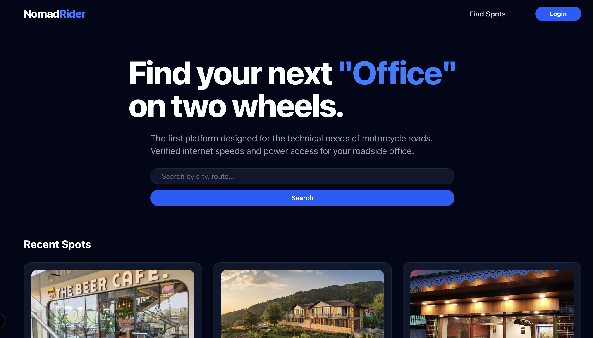
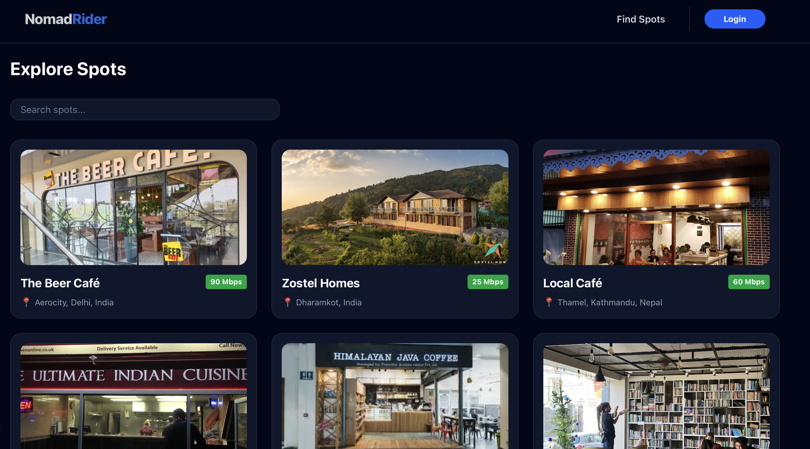
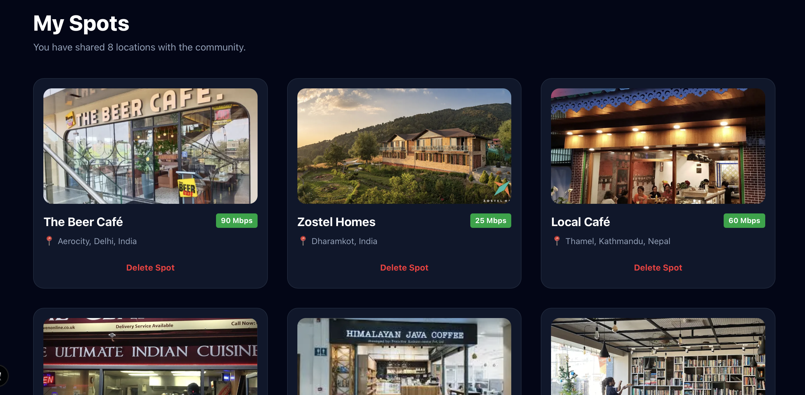

# nomad-rider
A travel-tech dashboard for digital nomads. Built with the T3 Stack (Next.js, TypeScript, Prisma), it helps remote workers find their next destination based on connectivity, community, and cost. No more "Wi-Fi anxiety" in paradise.

Nomad-Rider

Nomad-Rider is a full-stack travel-tech application designed for the modern remote worker. It bridges the gap between adventure and productivity by helping users discover work-friendly destinations, track travel logistics, and monitor "workability" metrics like Wi-Fi stability.

Key Features:

Work-Ready Discovery: Search for locations based on verified internet speeds.

User Authentication: Secure login for personalized travel logs.

Tech Stack:

Frontend: Next.js, Tailwind CSS, Shadcn UI

Backend: Node.js, Prisma ORM

Database: PostgreSQ

Authentication: Clerk

  
  
<i>The Nomad Rider Main Page</i>

  
  
<i>The Nomad Rider Find Spots (All Spots with Search Filter) Page </i>

  
  
<i>The Nomad Rider My Spots Page.</i> All the spots by the user and the option to delete them.

